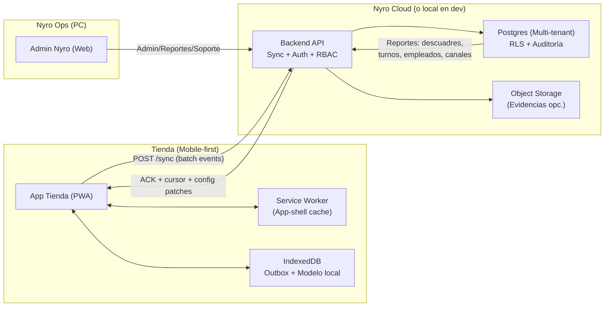
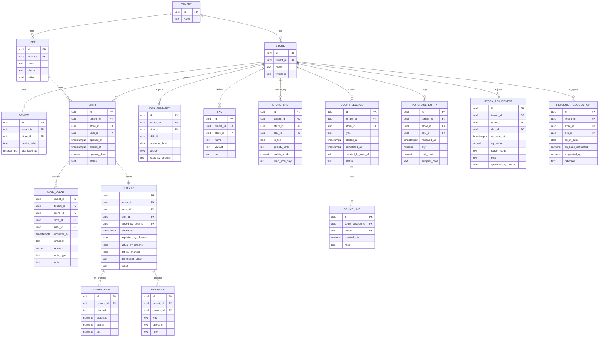

# Nyro ROaaS (Retail Operations as a Service)
## Documento técnico–funcional consolidado (Monorepo + PWA offline-first + Multi-tenant)

> **Principio rector**: **Nyro NO es un POS.** Nyro es un **backoffice operativo + servicio (ROaaS)** para micro-retail (Perú/LatAm), enfocado en:
> 1) **Conciliación multicanal y cierre de caja ultra-rápido** (cierre de turno + cierre diario)
> 2) **Inventario mínimo viable** basado en **inventario periódico + cycle counts** (sin ventas por SKU en el MVP)

---

## 0. Resumen de negocio y alcance (consolidado)

### 0.1 Qué es Nyro (propuesta de valor operativa)
Nyro es un servicio que combina software + disciplina operativa:

- **Cierre de caja multicanal** (Efectivo / Yape / Plin / POS-QR / Tarjeta / Transferencia) con método estándar + tablero simple.
- **Inventario mínimo viable (no “perfecto”)**: Top SKUs por tienda + variantes críticas.
- **Compras sugeridas (qué reponer)** basado en rotación real calculada por conteos y entradas (no por ventas por SKU).
- **Soporte y auditoría** (la parte ROaaS): monitoreo de descuadres, capacitación operativa, revisión de anomalías y mejora continua.

**Promesa vendible:** “Cierra en 5–10 minutos, detecta fugas, y deja de perder ventas por stock invisible”.

### 0.2 Contexto real de micro-retail (premisas de diseño)
- Conectividad inestable: se diseña **offline-first real**, no “offline de marketing”.
- Hora pico: UX ultra-compacta: **1 número + 1 tap de canal** (dos gestos, <3s).
- Empleados/turnos: se requiere trazabilidad “quién registró qué” + cierre por turno.
- Tiendas con POS y sin POS:
  - **Sin POS:** Nyro es el **system of record** del control de caja por canal (monto + canal).
  - **Con POS:** Nyro **no reemplaza POS**; integra **resúmenes** (manual/CSV/API si existe) para conciliación y control.

### 0.3 Restricciones / NO-GOALS (obligatorio)
- No benchmarking de POS. No convertir Nyro en POS.
- No scraping frágil o invasivo como pilar del producto.
- Minimizar dependencias y complejidad: “lo más simple que funcione” con evolución clara.
- No inventario perpetuo por ventas. Inventario se gestiona por **conteos + entradas + ajustes**.

---

## 1. Decisiones finales (ADR corto)

### 1.1 Monorepo vs multi-proyecto (decisión + por qué)
**Decisión final: Monorepo con 3 “deployables” separados** (App Tienda PWA, Admin Nyro, Backend API), compartiendo paquetes de dominio (types, validaciones, reglas) y tooling (CI/CD).

**Por qué:** reduce fricción de desarrollo (shared contracts y lógica), evita drift entre apps, y mantiene costos operativos bajos sin sacrificar aislamiento de despliegue (cada deployable se versiona y despliega independiente). Turborepo está diseñado para escalar monorepos con múltiples apps y paquetes compartidos.

**Riesgo real:** acoplar releases si no hay disciplina.  
**Mitigación:** pipelines por app, versionado por artefacto y “release trains” independientes (Store PWA no depende del release del Admin).

### 1.2 Estrategia offline-first + sync (decisión + por qué)
**Decisión final: Event-sourcing local (outbox en IndexedDB) + sync idempotente por lotes, con “cierre” como checkpoint.**

- Offline real: ventas/turnos/cierres se registran localmente en **IndexedDB** (estructurado, con índices) y se muestran al instante.
- Sync: el cliente envía **eventos append-only** con `event_id` único; el servidor deduplica con `UNIQUE(tenant_id, event_id)` + upsert idempotente (`INSERT ... ON CONFLICT ...`).
- Service Worker: **app-shell offline** y cache estratégico para assets y GETs necesarios.
- Background Sync: **best-effort**, no pilar (Safari/iOS no lo soporta), por eso el diseño asume “sync en foreground” (inicio y cierre).

### 1.3 Modelo multi-tenant (decisión + por qué)
**Decisión final: Postgres single-cluster, esquema compartido + `tenant_id` en todas las tablas “de negocio”, con Row Level Security (RLS) como defensa en profundidad.**

- Más simple y barato que “DB por tenant” para micro-retail.
- Escalable con índices compuestos `(tenant_id, store_id, created_at)` y particionado futuro si hiciera falta.
- RLS reduce riesgo de “data leak” por bugs de aplicación (sin reemplazar validaciones a nivel API).

### 1.4 Plan de integración “con POS / sin POS” (decisión + por qué)
**Decisión final: 2 modos operativos, sin scraping ni dependencias frágiles.**

- **Sin POS (modo principal MVP):** Nyro es el “system of record” del **control de caja por canal** (ventas “monto + canal” por evento).
- **Con POS (modo conciliación):** Nyro **no captura SKU ni reemplaza POS**; ingiere **resúmenes** por turno/día (manual en MVP; CSV template en iteración; API si existe en futuro). La conciliación compara: (a) totales Nyro por canal + (b) resumen POS (tarjeta/QR) + (c) conteo real (efectivo / verificación digital).

### 1.5 Backend API (lenguaje/runtime) — decisión final “simple y actual”
**Decisión final:** **TypeScript sobre Node.js LTS (Node 24 LTS)** para el Backend API, desplegado como **Vercel Functions (Node.js runtime)** dentro de un deployable separado (`apps/api`).

**Por qué (criterios):**
1) Un solo lenguaje end-to-end (Store PWA + Admin + API) reduce fricción y evita “drift” de contratos.  
2) Node LTS prioriza estabilidad.  
3) Para Nyro se requiere un runtime con APIs completas de Node (drivers Postgres, crypto, streaming).  
4) Se evita Edge runtime para el core de sync/DB por límites de compatibilidad.  

### 1.6 Dominios por tienda (multi-tenant a nivel Web)
**Decisión final:** `*.nyro.pe` como base (wildcard subdomains) + dominios personalizados opcionales por tienda, con regla obligatoria: **un dominio canónico por tienda** (redirigir el secundario).

**Por qué:** IndexedDB/Cache están aislados por origen; sin dominio canónico se “parte” la operación offline.

---

## 2. Arquitectura de alto nivel

### 2.1 Diagrama Mermaid (componentes + flujos)


### 2.2 Separación: App Tienda vs Admin Nyro vs Backend/DB
- **App Tienda (PWA):** UX ultra-rápida, offline-first, captura eventos (ventas, apertura/cierre, conteos), muestra totales esperados y ejecuta sync.
- **Admin Nyro (PC):** gestión de tenants/tiendas/usuarios, parámetros (canales, motivos de diferencia, Top SKUs), auditoría y reportes operativos.
- **Backend API:** autenticación, autorización (RBAC), ingestión idempotente de eventos, proyecciones para queries rápidas, reportes y soporte ROaaS.
- **DB Postgres:** verdad central (multi-tenant), constraints para consistencia, auditoría.

### 2.3 Tenancy: tiendas, usuarios, roles, permisos, auditoría
- **Tenant (organización):** agrupa tiendas.
- **Store (tienda):** unidad operativa (caja e inventario).
- **Usuarios y roles:** Owner/Manager/Cajero + Nyro Ops + Nyro Admin.
- **Permisos:** por tienda y rol (ej. cajero solo registra/cierra; owner aprueba ajustes y revisa).
- **Auditoría:** todos los eventos quedan en tabla append-only (quién, cuándo, qué, desde qué dispositivo).

---

## 3. App Tienda PWA (PRINCIPAL) — especificación técnica y de negocio (completa)

### 3.1 Principios UX (no negociables)
1) “Una pantalla = una decisión” en hora pico.  
2) Botones grandes + foco automático siempre en el monto.  
3) Feedback inmediato aunque no haya red: “Registrado (offline)” + contador del turno.  
4) Estado visible de sincronización: offline/pendiente/sincronizado con hora.  
5) Errores operativos accionables, no técnicos.  

### 3.2 Navegación (IA simple)
Barra inferior (4 tabs) + acción contextual:

- **Vender** (pantalla principal)
- **Turno** (resumen + controles apertura/cierre)
- **Cierres** (bitácora de cierres y diferencias del turno/día)
- **Stock** (Top SKUs: conteos y entradas)
- Acción contextual: **Sync ahora** (si hay cola o cierre pendiente)

### 3.3 Pantallas y componentes (detallado)

#### 3.3.1 Carga inicial por dominio (bootstrap)
Objetivo: resolver `store_id` por hostname y descargar config mínima (canales, motivos, Top SKUs, política de turnos).

UI:
- Splash con nombre de tienda (si ya está cacheado).
- Estado: “Cargando configuración…” / “Sin conexión: usando configuración guardada”.
- Si es primer uso y no hay cache: “Se requiere conexión inicial para activar esta tienda”.

#### 3.3.2 Login + selección rápida de usuario (multi-empleado)
Requisito: cambio de cajero sin fricción.

UI:
- Login online (primera vez) y luego sesión offline con expiración controlada.
- Selector de usuario (tiles) + PIN rápido opcional.
- Indicador: “Modo offline: algunos cambios se sincronizarán al reconectar”.

#### 3.3.3 Apertura de turno
UI:
1) Seleccionar usuario (si aplica).  
2) Ingresar **fondo inicial** (efectivo).  
3) “Iniciar turno” (se muestra reloj del turno y estado de sync).  

#### 3.3.4 Pantalla Vender (core: 2 taps)
Objetivo: **<3 segundos**, sin catálogo.

1) **Monto**: teclado numérico grande (autofocus).  
2) **Canal**: botones gigantes (Efectivo / Yape / Plin / POS-QR / Tarjeta / Transferencia).  

Resultado inmediato: “Venta registrada” + contador del turno actual.  
Opcional: nota rápida (chips): Descuento, Fiado, Devolución.  
Acción: “Deshacer última” (como evento compensatorio, no borrar).

#### 3.3.5 Turno (resumen operativo)
- Totales del turno por canal (Esperado) en tiempo real.
- Lista de últimas ventas (monto + canal + usuario + hora).
- Botón “Cierre guiado”.

#### 3.3.6 Cierre guiado (checkpoint)
Meta: 5–10 min guiado.

1) Pantalla “Esperado por canal” (calculado por eventos + resumen POS si aplica).
2) Ingresar “Real” por canal (efectivo contado; digitales verificados).
3) Si hay diferencia: seleccionar motivo + nota opcional + evidencia (foto opcional).
4) “Finalizar cierre”: ejecuta sync y exige ACK.
   - Si no hay internet: queda “pendiente” y **bloquea** el turno para nuevas ventas (evita mezclar turnos).
5) Confirmación: cierre “confirmado” con folio y resumen.

> **Separación clave:**
> - **Cierre de turno (cashier/manager/owner):** finaliza un turno específico.
> - **Cierre diario (manager/owner):** consolida todos los turnos del día con `business_date` y `shift_ids`.

#### 3.3.7 Cierres (bitácora y diferencias)
- Lista por turno con filtros: empleado, canal, delta, motivo, estado.
- Acción Owner: “Marcar revisado” (evento de auditoría).

#### 3.3.8 POS (modo conciliación)
- Captura manual del resumen POS por turno/día (tarjeta/QR) en MVP.
- Posterior: plantilla CSV; futuro: API si existe.
- La conciliación compara totales Nyro vs resumen POS vs conteo real.

#### 3.3.9 Stock (inventario mínimo viable: Top 80)
No hay ventas por SKU. Solo rutina:

- Top SKUs: nombre, variante, on-hand estimado, riesgo de quiebre.
- Conteo semanal (20 de 80): wizard con progreso, input rápido, offline ok.
- Entradas (compras): SKU + qty; costo opcional; proveedor opcional.
- Ajustes: motivo + aprobación Owner/Manager.

### 3.4 Diseño offline-first (PWA)

#### 3.4.1 Qué se guarda localmente (modelo local)
En IndexedDB (por `tenant_id + store_id + device_id`):

- Identidad y sesión offline: `device_id`, claims/roles cacheados, expiración.
- Outbox (cola de eventos): ventas, apertura/cierre, motivos, conteos, compras, ajustes.
- Proyección local mínima: turno actual, totales esperados por canal, lista de canales, Top SKUs, últimos cierres, estado de sync.
- Evidencias opcionales: foto comprimida como Blob con límite estricto (para evitar presión de almacenamiento).

#### 3.4.2 Cola de eventos / outbox local, idempotencia, reintentos
- Cada acción operativa genera un evento append-only con `event_id` único.
- El sync envía batch (p.ej. 50–200 eventos) y espera ACK por `event_id`.
- En servidor, deduplicación con constraint única por tenant (`event_id`) y upsert idempotente.
- Reintentos: exponencial con jitter en foreground; Background Sync best-effort.
- Importante: Safari/iOS no soporta Background Sync, por eso el diseño asume sync en foreground (inicio y cierre).

#### 3.4.3 Resolución de conflictos (si 2 empleados registran offline)
Principio: evitar conflictos diseñando eventos que no se pisan.

- Ventas: no hay conflicto (append-only).
- Turnos: backend aplica reglas soft (un turno activo por usuario y tienda); duplicados se marcan para revisión.
- Cierres: un cierre final por turno; el segundo queda rechazado por conflicto con trazabilidad.
- Inventario: conteos se conservan; para conflicto se requiere aprobación para definir conteo vigente.

#### 3.4.4 Estrategia de cache (Service Worker) y límites conocidos (iOS)
- Service Worker para app-shell offline y cache estratégico.
- Config con stale-while-revalidate.
- Diseño no depende de background tasks: se sincroniza al abrir/cerrar y cuando el usuario lo dispara.

#### 3.4.5 “Cierre” como checkpoint de sync (consistencia)
- Antes de finalizar, la app ejecuta sync y exige ACK completo del turno.
- El backend valida consistencia y vuelve el cierre inmutable al confirmarse.
- Resultado: cierre confirmado como verdad operativa del turno/día.

---

## 4. Modelo de datos (mínimo pero completo)

### 4.1 Entidades/tablas para conciliación e inventario (ERD con campos)


### 4.2 Notas de consistencia (MVP, esenciales)
- `SALE_EVENT.event_id` es el idempotency key (único por tenant).
- En tablas de negocio se indexa `(tenant_id, store_id, occurred_at)` para reportes por rango.
- RLS: políticas por `tenant_id` para prevenir accesos cruzados (defensa en profundidad).

---

## 5. Flujos operativos “10x mejor que papel”

### 5.1 Flujo exacto “2 taps” registro de venta
Objetivo: **<3 segundos**, sin catálogo.

1) **Monto**: teclado numérico grande (autofocus).  
2) **Canal**: botones gigantes (Efectivo / Yape / Plin / POS-QR / Tarjeta / Transferencia).  

Resultado inmediato: “Venta registrada” + contador del turno actual.  
Opcional: “nota rápida” (chips): Descuento, Fiado, Devolución.

### 5.2 Flujo apertura/cierre por turno
**Apertura (30–60s):**
1) Seleccionar usuario (PIN rápido opcional).  
2) Ingresar fondo inicial (efectivo).  
3) “Iniciar turno” (visible reloj del turno y estado de sync).  

**Cierre guiado (meta: 5–10 min):**
1) “Esperado por canal” (calculado por eventos + resumen POS si aplica).  
2) Ingresar “Real” por canal (efectivo contado; digitales verificados).  
3) Si hay diferencia: seleccionar motivo + nota opcional + evidencia (foto opcional).  
4) “Finalizar cierre”: ejecuta sync; si no hay internet, queda “pendiente” y bloquea turno para nuevas ventas (evita mezclar turnos).  
5) Confirmación: cierre “confirmado” con folio y resumen.  

**Cierre diario (manager/owner):**
1) Consolidar turnos del día (`business_date`).
2) Ingresar reales por canal (efectivo/digital).
3) Confirmar diferencias y justificar si aplica.
4) “Finalizar cierre diario”: exige ACK; se crea `closure` con `shift_ids`.

### 5.3 Rutina semanal de cycle counts para Top SKUs (paso a paso)
Principio: no inventario perpetuo; solo conteos y entradas; consumo por delta.

1) Owner/Manager define Top 80 por tienda (prioridad/criticidad).  
2) Se divide en 4 listas (20/semana).  
3) Cada semana: abrir “Conteo semanal (lista 1/4)”.  
4) Contar físicamente, ingresar cantidades (offline).  
5) Registrar entradas (compras) al recibir (SKU + qty).  
6) Calcular consumo aproximado: `consumo ≈ (stock_prev + entradas - stock_actual)` y sugerir reposición (lead time + safety stock).  
7) Ajustes (merma/robo/vencimiento): registrar ajuste con motivo (aprobación Owner).  

### 5.4 Qué hace el dueño vs empleado vs ROaaS Nyro
- **Empleado (cajero):** registra ventas (2 taps), abre/cierra turno y registra diferencias con motivo cuando corresponde.  
- **Dueño/Manager:** revisa descuadres por empleado/canal, aprueba ajustes, define Top SKUs, ejecuta conteos, decide reposición.  
- **ROaaS Nyro (Ops):** monitorea patrones de descuadre, audita cierres anómalos, configura disciplina operativa, propone acciones.  

---

## 6. Roadmap funcional (sin tiempos) + riesgos + métricas

### 6.1 Fase 1 — Base operativa (conciliación + cierre) [sin tiempos]
Entregables técnicos concretos:

1) Monorepo con 3 apps (Store PWA, Admin, API) + paquete compartido `domain` (tipos + validaciones).  
2) Backend API (mínimo):
   - Auth (login online), device registration, RBAC.  
   - Endpoint `POST /sync`: ingestión batch idempotente + cursor + descarga de config.  
   - Postgres schema + RLS base por tenant.  
3) Store PWA (offline real):
   - IndexedDB: outbox + proyección local turno/ventas/totales.  
   - Service Worker: app-shell offline + cache de config.  
   - Flujos: venta 2 taps, apertura turno, cierre guiado, bitácora de cierres/diferencias.  
4) Admin Nyro (mínimo usable): alta tienda, usuarios/roles, canales, motivos de diferencia; reporte básico de descuadres.  
5) Modo “Con POS” (MVP): captura manual de resumen POS por turno/día para conciliación.  
6) Observabilidad mínima: logs estructurados, métricas de latencia del sync, tasa de reintento, tiempo de cierre.  

### 6.2 Fase 2 — Inventario periódico + reposición [sin tiempos]
1) Config Top SKUs por tienda (80) + prioridad + lead time + safety stock.  
2) Conteo inicial (baseline) y conteos semanales por listas (20/semana).  
3) Entradas (compras) rápidas (SKU + qty; costo opcional).  
4) Ajustes con motivo + aprobación (Owner/Ops).  
5) Cálculo de consumo por delta + reposición sugerida (simple, operable).  
6) Reporte “Stock visible”: quiebres probables y cumplimiento de rutina de conteo.  

### 6.3 Riesgos top 10 y mitigaciones
1) iOS sin Background Sync: diseñar sync en foreground + cierre como checkpoint.  
2) Pérdida de datos por limpieza de storage: minimizar blobs; sincronizar en cada cierre; opción de export local.  
3) Deriva de reloj del dispositivo: server asigna `occurred_at_server`; el cliente conserva `occurred_at_local` para UX.  
4) Duplicidad de turnos (multi-device): reglas soft + flags + revisión Owner/Ops.  
5) Errores humanos en conteo: doble conteo opcional para SKUs críticos + auditoría por variaciones extremas.  
6) Adopción en hora pico: UX 2 taps, botones enormes, sin catálogos, sin pantallas intermedias.  
7) Seguridad multi-tenant: RLS + validación en API + tests de aislamiento.  
8) Data inconsistente por reintentos: idempotencia por `event_id` + constraints.  
9) Integración POS heterogénea: empezar manual/CSV; no depender de APIs de terceros.  
10) Sobrecarga de features: mantener NO-POS; evitar SKU-per-venta; inventario solo por conteos/entradas.  

### 6.4 Métricas de éxito
- Registro de venta: p50 <3s; p90 <6s.  
- Tiempo de cierre: mediana 5–10 min por turno.  
- Tasa de descuadre: reducción semanal (objetivo: -30% en 4 semanas).  
- Adopción: % turnos cerrados el mismo día; % ventas registradas (modo sin POS).  
- Sync health: % cierres confirmados con ACK completo; reintentos promedio por evento.  
- Inventario Top: % SKUs Top contados según rutina; error absoluto medio; frecuencia de quiebre en Top.  

---

## 7. Admin Nyro (BÁSICO) — lo mínimo necesario

> El foco del producto es la App Tienda; el Admin habilita el servicio ROaaS.

### 7.1 Funcionalidades mínimas
- Alta de tenant y tienda
- Gestión de dominios (subdominio, custom, canónico)
- Gestión de usuarios, roles y asignación por tienda
- Configuración por tienda: canales, motivos, Top SKUs, parámetros de inventario
- Reportes básicos: descuadres, cierres pendientes, salud de sync
- Auditoría: feed de eventos y acciones para soporte

### 7.2 Pantallas mínimas
- Dashboard de salud (tiendas con problemas)
- Tienda (config + dominios + reglas)
- Usuarios (roles, estado, asignación)
- Caja (descuadres, cierres, anomalías)
- Inventario (Top SKUs, cumplimiento de conteos)
- Auditoría (event feed por tienda)

---

## 8. Backend API + DB — arquitectura completa (incluye dominios, seguridad, observabilidad)

### 8.1 Responsabilidades
- Auth + RBAC
- Resolución host -> tenant/store
- Ingestión idempotente de eventos (`/sync`)
- Proyecciones/reportes operativos (descuadres, turnos, cierres, inventario)
- RLS y defensas en profundidad en Postgres
- Auditoría y soporte ROaaS
- Evidencias opcionales (object storage)

### 8.2 Contratos de API (sin código)
**Auth**
- Login (online) + refresh
- Revocación/rotación de tokens
- Device registration (vincula device con store/tenant)

**Bootstrap/config**
- Resolver store por host y devolver config mínima cacheable
- Parches de config devueltos en `/sync` (evita llamadas extra en hora pico)

**Sync**
- `POST /sync`:
  - Entrada: batch de eventos append-only + cursor local
  - Salida: ACK de eventos, rechazados con reason, cursor server, parches de config, flags de conflicto

**Admin**
- CRUD de stores, users, config, dominios
- Reportes y auditoría

### 8.3 Multi-tenant y RLS (defensa en profundidad)
- `tenant_id` en todas las tablas de negocio.
- El backend asigna `tenant_id` desde auth/host; nunca confía en el cliente para tenant.
- RLS: políticas de SELECT/INSERT/UPDATE/DELETE por tenant.
- Auditoría append-only: eventos y acciones críticas (cierres, ajustes, aprobaciones).

### 8.4 Tablas adicionales recomendadas (para cerrar sync y dominios)
- `INGESTED_EVENT` (o `EVENT_LOG`): dedupe + auditoría + soporte (accepted/rejected/conflict).
- `STORE_DOMAIN`: host -> store y dominio canónico.

### 8.5 Índices/constraints críticos (MVP)
- `UNIQUE(tenant_id, event_id)` en ingestión (idempotencia fuerte).
- Índices por tenant/store/tiempo para ventas, turnos, cierres.
- `UNIQUE(domain)` en store domains.
- Índices por tenant/store/sku en inventario.

### 8.6 Observabilidad mínima
- Logs estructurados (tenant/store, batch_size, latency, accepted/rejected).
- Métricas de salud del sync y cierres pendientes.
- Auditoría accesible para Nyro Ops.

---

## 9. DevOps básico (GitHub Actions + Vercel CD) y repo structure

### 9.1 Estructura del monorepo
```
nyro/
  apps/
    store/               # App Tienda PWA (Next.js)
    admin/               # Admin Nyro (Next.js)
    api/                 # Backend API (Next.js Route Handlers, nodejs runtime)
  packages/
    domain/              # contratos: tipos/eventos/validaciones
    db/                  # schema/migraciones/helpers
    config/              # tooling compartido (tsconfig/eslint/prettier)
  .github/workflows/     # CI (checks por PR y main)
  docs/architecture/     # documentación técnica
```

### 9.2 CD en Vercel (3 Projects conectados al mismo repo)
- `apps/store` → `*.nyro.pe` + custom domains por tienda
- `apps/admin` → `admin.nyro.pe`
- `apps/api` → `api.nyro.pe`

Cada Project tiene variables y dominios independientes.

### 9.3 CI en GitHub Actions (sin YAML aquí)
- Typecheck + lint + build por app afectada.
- Checks obligatorios para merge.
- Enfoque: proteger Store PWA y `packages/domain` (core del negocio).

### 9.4 Local dev (DB local + backend local)
- Postgres local (docker o nativo).
- API local apuntando a Postgres local.
- Store/Admin apuntando al API local.
- Seed mínimo para iterar el flujo completo (tenant/store/usuarios/canales/motivos).

---

## 10. Referencias técnicas (solo 8–12 links)
1) Turborepo Docs: https://turborepo.com/docs  
2) Vercel — Using Monorepos: https://vercel.com/docs/monorepos  
3) Vercel — Monorepos FAQ: https://vercel.com/docs/monorepos/monorepo-faq  
4) Vercel — Working with Domains (wildcards): https://vercel.com/docs/domains/working-with-domains  
5) Vercel — Multi-tenant Domain Management: https://vercel.com/docs/multi-tenant/domain-management  
6) Next.js — Route Handlers: https://nextjs.org/docs/app/building-your-application/routing/route-handlers  
7) Next.js — Runtime option (nodejs/edge): https://nextjs.org/docs/app/api-reference/file-conventions/route-segment-config#runtime  
8) MDN — IndexedDB API: https://developer.mozilla.org/en-US/docs/Web/API/IndexedDB_API  
9) MDN — Using Service Workers: https://developer.mozilla.org/en-US/docs/Web/API/Service_Worker_API/Using_Service_Workers  
10) MDN — Storage quotas and eviction: https://developer.mozilla.org/en-US/docs/Web/API/Storage_API/Storage_quotas_and_eviction_criteria  
11) PostgreSQL — RLS: https://www.postgresql.org/docs/current/ddl-rowsecurity.html  
12) PostgreSQL — INSERT ... ON CONFLICT: https://www.postgresql.org/docs/current/sql-insert.html  
